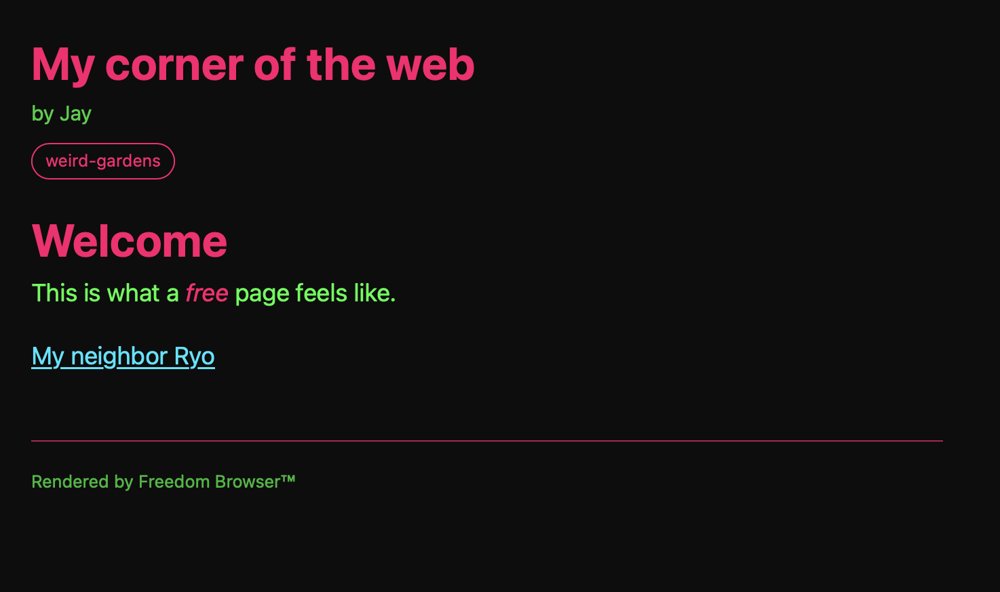

# Freedom Browser™

The web used to feel like something, with everyone having their own place to express themselves.

Freedom Browser exists to revive that.

---

This project is in early development. Stay tuned for updates.

---

Freedom Browser renders `.free` pages, a new document format for an organic web. No JavaScript, ads, or surveillance. Just pages that belong to their creators.

## What does .free look like?
~~~
~ free 0.1
~ title: My corner of the web
~ author: Jay
~ palette: neon-noir
~ ring: weird-gardens

---

# Welcome

This is what a *free* page feels like.

[My neighbor Ryo -> ryo@free-web.net]

~ end
~~~

## What Freedom Browser isn't
Freedom Browser is *not* a general purpose browser. It doesn't render HTML, CSS, or JavaScript. It exists to serve its proprietary format, `.free`.

---

*Freedom Browser™, A Human Web*
*Built by Jay Proctor*
*[free-web.net](https://free-web.net)*
